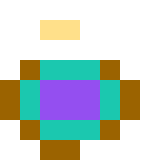
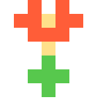
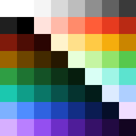

# PixelScript

<p align="center">
  
</p>

<p align="center">
  <strong>Programmatic pixel art for JavaScript.</strong><br>
  Build sprites and animations from arrays or compact Base64 pixel strings, then render them as <code>SVG</code>, <code>PNG</code>, <code>GIF</code>, or <code>Canvas</code> from the same JSON source.
</p>

<p align="center">
  
  
  
  
  
</p>

## Why PixelScript

- One canonical JSON document model for every output.
- Programmatic authoring from numeric arrays, compact strings, or shareable JSON files.
- Built-in 64-slot palette keyed to the Base64 character set, including transparency at slot `0`.
- Browser-first runtime plus Node-friendly rendering for docs, pipelines, and asset generation.
- Inline HTML support through `<pixel-art>`.

## Install

```bash
npm install @ibimspumo/pixelscript
```

## Same Art, Different Outputs

<table>
  <tr>
    <td align="center"><strong>SVG</strong></td>
    <td align="center"><strong>PNG</strong></td>
    <td align="center"><strong>GIF</strong></td>
  </tr>
  <tr>
    <td align="center"></td>
    <td align="center"></td>
    <td align="center"></td>
  </tr>
</table>

```js
import { createAnimation, renderGIF, renderPNG, renderSVG } from '@ibimspumo/pixelscript';

const comet = createAnimation({
  width: 6,
  height: 3,
  frames: [
    { pixels: [0, 0, 0, 6, 1, 0, 0, 0, 6, 1, 0, 0, 0, 6, 1, 0, 0, 0] },
    { pixels: [0, 0, 6, 1, 0, 0, 0, 6, 1, 0, 0, 0, 6, 1, 0, 0, 0, 0] }
  ],
  animation: { fps: 8, loop: true }
});

const svg = renderSVG(comet, { scale: 18 });
const png = await renderPNG(comet, { scale: 18 });
const gif = await renderGIF(comet, { scale: 18, iterations: 'infinite' });
```

## Sprite Shelf

<table>
  <tr>
    <td align="center">
      <br>
      <strong>Ghost Wave</strong><br>
      <a href="./docs/readme-assets/ghost-wave.json">JSON</a>
    </td>
    <td align="center">
      <br>
      <strong>Pixel Buddy</strong><br>
      <a href="./docs/readme-assets/cat-face.json">JSON</a>
    </td>
    <td align="center">
      <br>
      <strong>Potion Brew</strong><br>
      <a href="./docs/readme-assets/potion-brew.json">JSON</a>
    </td>
    <td align="center">
      <br>
      <strong>Flower Spark</strong><br>
      <a href="./docs/readme-assets/flower-spark.json">JSON</a>
    </td>
  </tr>
</table>

## Compact At The Core

PixelScript stores each frame as a compact row-major string over the Base64 alphabet. That keeps the source small, diffable, and easy to share.

```json
{
  "version": 1,
  "width": 8,
  "height": 8,
  "palette": {
    "kind": "default64",
    "name": "PixelScript-64"
  },
  "frames": [
    {
      "pixels": "ABCDEFGHIJKLMNOPQRSTUVWXYZabcdefghijklmnopqrstuvwxyz0123456789+/"
    }
  ],
  "meta": {
    "name": "PixelScript-64 Grid"
  }
}
```

<p align="center">
  
</p>

- `A` is palette index `0`, reserved for transparency.
- `B` is palette index `1`, the first visible slot.
- The full built-in palette is visualized above and can be replaced with custom palettes up to 64 entries.

## JavaScript API

```js
import {
  createArt,
  createAnimation,
  mountPixelArt,
  renderPNG,
  renderSVG
} from '@ibimspumo/pixelscript';

const checker = createArt({
  width: 2,
  height: 2,
  pixels: [0, 1, 0, 1]
});

const beacon = createAnimation({
  width: 4,
  height: 4,
  frames: [
    { pixels: 'ABABABABABABABAB', durationMs: 120 },
    { pixels: 'BABABABABABABABA', durationMs: 120 }
  ],
  animation: {
    fps: 8,
    loop: true
  }
});

const svg = renderSVG(checker, { scale: 24 });
const png = await renderPNG(checker, { scale: 24 });

const controller = mountPixelArt(document.querySelector('#target'), beacon, {
  render: 'canvas',
  scale: 20,
  autoplay: true
});

const firstPixel = controller.getPixel(0, 1, 1);
console.log('Frame 0, pixel (1,1):', firstPixel);

controller.setPixel(0, 4, 4, 8);
controller.setPixels(0, [
  { x: 3, y: 3, paletteIndex: 2 },
  { x: 4, y: 3, paletteIndex: 3 }
]);

controller.play({ iterations: 2 });
```

## Inline HTML

```html
<script src="./dist/pixelscript.min.js"></script>

<pixel-art
  render="gif"
  scale="18"
  autoplay
  loop
  src="./docs/readme-assets/comet-burst.json"
></pixel-art>
```

Module usage can register the element explicitly:

```js
import { registerPixelArtElement } from '@ibimspumo/pixelscript/element';

registerPixelArtElement();
```

## Per-Pixel Interaktion (Canvas only)

Pointer interactions are supported on `<pixel-art render="canvas">`:

- `pixelscript:pixel-hover`
- `pixelscript:pixel-enter`
- `pixelscript:pixel-leave`
- `pixelscript:pixel-down`
- `pixelscript:pixel-up`
- `pixelscript:pixel-click`
- `pixelscript:pixel-drag`
- `pixelscript:pixel-hold`
- `pixelscript:pixel-change` when pixels are changed programmatically

```js
const hero = document.querySelector('pixel-art#hero-art');

hero.addEventListener('pixelscript:pixel-click', (event) => {
  const detail = event.detail;
  console.log('clicked pixel', detail.sourceX, detail.sourceY, detail.paletteIndex);
  hero.setPixel(detail.sourceX, detail.sourceY, 0);
});

hero.addEventListener('pixelscript:pixel-change', (event) => {
  const detail = event.detail;
  console.log('pixel changed', detail.previousIndex, '->', detail.paletteIndex, 'at', detail.sourceX, detail.sourceY);
});
```

## Shareable Documents

Every visual in this README is generated from PixelScript documents in [`docs/readme-assets`](./docs/readme-assets):

- [hero-arcade-night.json](./docs/readme-assets/hero-arcade-night.json)
- [ghost-wave.json](./docs/readme-assets/ghost-wave.json)
- [comet-burst.json](./docs/readme-assets/comet-burst.json)
- [palette-grid.json](./docs/readme-assets/palette-grid.json)

That same JSON can be used in:

- JavaScript code
- inline HTML via `data` or `src`
- docs generation
- static asset pipelines

## Public API

- `createArt(input)`
- `createAnimation(input)`
- `parseDocument(json)`
- `validateDocument(json)`
- `stringifyDocument(doc)`
- `parseCompact({ width, height, pixels, palette? })`
- `fromArray({ width, height, pixels, palette? })`
- `getDefaultPalette()`
- `definePalette({ name?, colors })`
- `validatePalette(palette)`
- `renderSVG(doc, options)`
- `renderCanvas(doc, options)`
- `renderPNG(doc, options)`
- `renderGIF(doc, options)`
- `renderDataURL(doc, options)`
- `mountPixelArt(target, doc, options)`
- `registerPixelArtElement()`
- `PixelArtController` APIs returned by `mountPixelArt`
  - `getPixel(frameIndex, x, y)`
  - `setPixel(frameIndex, x, y, paletteIndex)`
  - `setPixels(frameIndex, updates)`
  - `getCurrentFrame()`
  - `play(options)`
  - `pause()`
  - `stop()`
  - `seek(frameIndex)`
- `<pixel-art>` element instance methods
  - `getPixel(x, y, frameIndex?)`
  - `setPixel(x, y, paletteIndex, frameIndex?)`
  - `setPixels(updates, frameIndex?)`

## Development

```bash
npm install
npm run dev
npm run typecheck
npm test
npm run readme:assets
```

README visuals are generated by [`scripts/generate-readme-assets.mjs`](./scripts/generate-readme-assets.mjs).

## Links

- Demo/docs app: [demo/main.ts](./demo/main.ts)
- JSON schema: [schema/pixelscript.schema.json](./schema/pixelscript.schema.json)
- Example docs: [examples/checker.json](./examples/checker.json), [examples/comet.json](./examples/comet.json)
- GitHub Pages demo: `https://ibimspumo.github.io/PixelScript/`

## License

MIT
